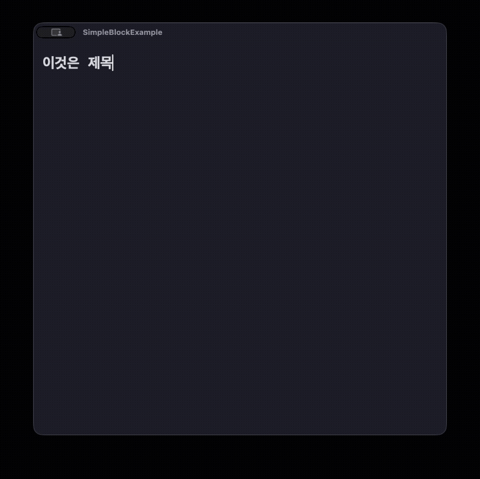

# SimpleBlockEditor

## 소개

간단한 노션풍 텍스트 에디터입니다.

- AppKit으로 작성
- Observation 프레임워크 기반으로 이벤트 감지하고, 영향을 받는 뷰만 갱신해 렌더 비용을 최적화
- [Policy 인터페이스](SimpleBlockEditor/Protocol/BlockEditingPolicy.swift)를 통해 커스텀 파서 등록 가능
- [Store 인터페이스](SimpleBlockEditor/Protocol/BlockStore.swift)를 통해 커스텀 데이터베이스 연동 가능

## Todo

- [ ] ordered policy 추가
- [ ] 텍스트뷰 높이 고정(한글, 영어, 공백)
